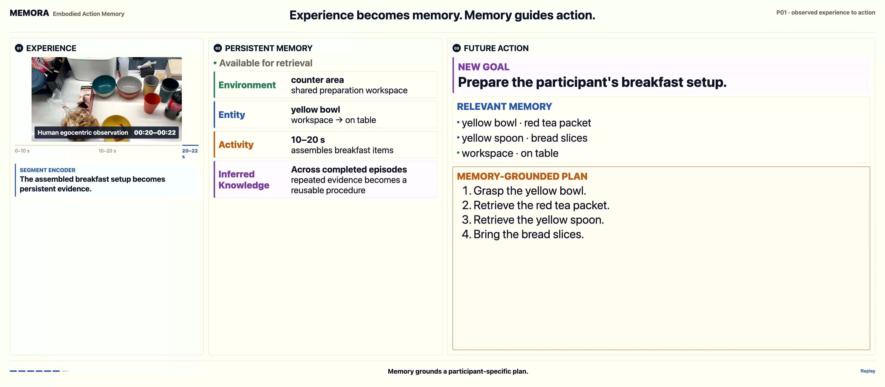

<div align="center">


**Embodied Action Memory from Egocentric Videos for Reasoning and Planning**

<p>
  &nbsp;&nbsp;&nbsp;&nbsp;&nbsp;
  <a href="https://yuzihaowashu.github.io">Zihao Yu</a>&nbsp;&nbsp;&nbsp;&nbsp;&nbsp;&nbsp;&middot;&nbsp;&nbsp;&nbsp;&nbsp;&nbsp;&nbsp;
  <a href="https://xiuyuan0216.github.io">Xiu Yuan</a>&nbsp;&nbsp;&nbsp;&nbsp;&nbsp;&nbsp;&middot;&nbsp;&nbsp;&nbsp;&nbsp;&nbsp;&nbsp;
  <a href="https://engineering.washu.edu/faculty/Chongjie-Zhang.html">Chongjie Zhang</a><br>
  Washington University in St. Louis
</p>

[](https://arxiv.org/abs/2607.14252)
[](https://yuzihaowashu.github.io/MEMORA/)
[](https://huggingface.co/datasets/DependableDavid/MEMORA)
[](https://yuzihaowashu.github.io/MEMORA/benchmark-explorer.html)
[](LICENSE)


[OpenReview](https://openreview.net/group?id=roboticsfoundation.org/RSS/2026/Workshop/FM4RoboPlan#tab-accept-oral)
 ·
[Workshop](https://sites.google.com/alumni.brown.edu/fm4roboplan26/home)

</div>

## 🔥 News

- **August 2026:** Accepted to **EMNLP 2026**.
- **August 2026:** Code, MEMORA-Bench, participant memory, and saved evaluation outputs released.
- **July 2026:** Accepted as an **oral presentation** at the **RSS 2026 Workshop on Robot Planning in the Era of Foundation Models**.
- **July 2026:** Paper released on [arXiv](https://arxiv.org/abs/2607.14252).

## Abstract

Long-horizon robot planning requires more than predicting what actions will do
next; it also requires memory of the embodied experience that makes future goals
interpretable. People do not plan from the present scene alone: they draw on
remembered places, object-state changes, prior procedures, and regularities
revealed through repeated action. We formulate **Embodied Action Memory (EAM)** as
the capability to form, maintain, and use such experience as a persistent memory
state for later decisions.

MEMORA realizes EAM with a **formation--consolidation--retrieval lifecycle** and
four typed stores:  **Environment Memory**,
 **Entity Memory**,
 **Activity Memory**, and
 **Inferred Knowledge**.
**Online editing** maintains object identities and state histories as new
observations arrive; **offline consolidation** abstracts repeated experience into
reusable procedures and participant-specific regularities.

**MEMORA-Bench** evaluates this lifecycle on 45 hours of EPIC-KITCHENS-100
extension video across 18 participants through **memory-grounded planning**, including
previously unseen goals, and a complementary memory-assessment task. Across four
open-weight language models, full MEMORA--combining editing, typed stores, and
consolidation--achieves the strongest aggregate results among the evaluated
memory conditions.

It improves memory-assessment accuracy by up to 20.5 points over the strongest
controlled baseline and improves out-of-distribution Robot-Grounded Plan score
by up to 16.6% relative. A qualitative two-task robot deployment study further
illustrates how memory-grounded language plans can interface with downstream
control, while the overall results show that editable, consolidated memory can
supply remembered context for robot planning.

## Why MEMORA?

Embodied experience is the source from which memory is formed. As experience
unfolds, it provides evidence about spatial context, changing entities, and
temporally ordered actions; across episodes, that evidence can be consolidated
into reusable regularities. MEMORA gives this experience-to-memory process a
persistent computational form, allowing a planner to recover not only how to
act, but also what prior experience makes a new goal meaningful for a particular
participant and environment.

<p align="center">
  <a href="https://yuzihaowashu.github.io/MEMORA/#overview">
    
  </a>
</p>
<p align="center">
  <a href="https://yuzihaowashu.github.io/MEMORA/#overview"><strong>▶ Watch the MEMORA lifecycle</strong></a>
</p>

## ⭐ Key Features

- **A lifecycle from experience to action.** MEMORA treats memory as an evolving process rather than a passive archive. Egocentric observations are encoded into and maintained as persistent memory, consolidated across episodes, and retrieved when later reasoning or planning makes them relevant.

- **Memory organized by embodied continuities.** Four typed stores preserve what evolves differently in experience: Environment Memory for spatial context, Entity Memory for identity and state, Activity Memory for temporally ordered evidence, and Inferred Knowledge for regularities that emerge across events.

- **Maintenance at two timescales.** Online editing preserves identity and state history as new observations arrive. Offline consolidation transforms repeated experience into reusable procedures and participant-specific regularities without discarding their supporting episodes.

- **Evaluation from remembering to planning.** MEMORA-Bench pairs retrospective memory assessment with prospective memory-grounded planning. Replay tests observed workflows, while Generalize asks whether remembered evidence can support transfer, composition, and goals not directly observed.

## 📦 What is released?

| Component | Location | Purpose |
|---|---|---|
| Source code | This repository | Form memory, retrieve evidence, and run evaluation |
| MEMORA-Bench | [`src/memora_bench/`](src/memora_bench/) | EAM-QA questions and MEMORA-Planning goals with ground truth |
| Participant memory | [Hugging Face](https://huggingface.co/datasets/DependableDavid/MEMORA) | Four-store memory for the 18 released participants |
| Saved evaluation outputs | [Hugging Face](https://huggingface.co/datasets/DependableDavid/MEMORA) | Recompute paper metrics without running model inference |
| Source egocentric video | [EPIC-KITCHENS](https://epic-kitchens.github.io/2025) | Original recordings; not redistributed by MEMORA |

MEMORA-Bench contains **2,212 answerable EAM-QA items**, **551 explicit
unanswerable controls**, **207 Planning Replay goals**, and **153 Planning
Generalize goals** over 18 participants. Browse representative questions,
choices, goals, and ground truth in the [interactive explorer](https://yuzihaowashu.github.io/MEMORA/benchmark-explorer.html).

## 🚀 Quick start

Choose the path that matches what you want to verify.

| Path | What it does | Compute |
|---|---|---|
| [Reproduce released results](#reproduce-released-results) | Recompute paper metrics from saved model outputs | CPU |
| [Build memory from video](#build-memory-from-video) | Run formation, consolidation, retrieval, and planning on new experience | GPU or model API |

### Reproduce released results

```bash
git clone https://github.com/yuzihaowashu/MEMORA.git
cd MEMORA

bash scripts/setup_environment.sh analysis
source .venv/bin/activate

export MEMORA_DATA_ROOT=/path/to/memora_data
python3 scripts/data/download.py

source scripts/configure_paths.sh
bash scripts/data/verify.sh
```

MEMORA supports Python 3.10-3.12. If `python3` resolves to a newer version,
select a supported interpreter explicitly, for example
`PYTHON_BIN=python3.12 bash scripts/setup_environment.sh analysis`.

Run one EAM-QA result and one Generalize planning result:

```bash
bash scripts/paper_results/commands/eam_qa/gemma4_26b.sh
bash scripts/paper_results/commands/planning_generalize/qwen3_6_35b.sh --refresh
```

Expected headline values from the released outputs:

| Metric | Expected |
|---|---:|
| Gemma-4-26B-A4B-it MEMORA EAM-QA | **about 54.1%** |
| Qwen3.6-27B MEMORA EAM-QA | **about 69.1%** |
| Qwen3.6-35B-A3B MEMORA-Planning Replay RGP | **about 0.338** |
| Qwen3.6-35B-A3B MEMORA-Planning Generalize RGP | **about 0.450** |

See [`scripts/paper_results/README.md`](scripts/paper_results/README.md) for the
curated result commands and [`docs/REPRODUCE.md`](docs/REPRODUCE.md) for the
complete protocol.

### Build memory from video

The formation path follows the paper:

```text
egocentric video
  -> Segment Encoder
  -> Memory Editor
  -> offline consolidation
  -> type-aware retrieval and planning
```

The stages exchange files through one user-chosen run directory:

1. **Encode experience** with `memora-segment-encode`  
   Reads videos and a video-ID list; writes `$RUN_ROOT/segment_observations/segment_observations.jsonl`.

2. **Form and consolidate memory** with `memora-memory-edit --run-offline-consolidation`  
   Reads Stage 1 observations; writes `$RUN_ROOT/participant_memory/participant_memory.json`.

3. **Plan from memory** with `memora-plan`  
   Reads Stage 2 memory and a planning task; writes `$RUN_ROOT/planning/`.

Each stage's primary output is the next stage's input. Graph-2D construction is
an optional comparison path and is not part of the default MEMORA pipeline.

Create the full environment with `bash scripts/setup_environment.sh gpu`, or configure
an API-backed model where supported. The end-to-end commands, model roles, and
file contracts are documented in [`docs/PIPELINE.md`](docs/PIPELINE.md).

## Run new evaluations

After creating the GPU environment and downloading the data package, the public
CLIs can run new EAM-QA and planning inference. For example:

```bash
memora-eam-qa run \
  --model google/gemma-4-26B-A4B-it \
  --benchmark-file "$EAM_QA_BENCH_DIR/p01.json" \
  --condition no_memory \
  --output "$MEMORA_DATA_ROOT/outputs/quickstart/no_memory_p01/results_eam_qa.json" \
  --tensor-parallel-size 2 \
  --max-model-len 65536
```

Planning commands and multi-run examples are in [`docs/SETUP.md`](docs/SETUP.md).

## ⚙️ Runtime requirements

| Use case | Environment | Main requirement |
|---|---|---|
| Inspect benchmark JSON | None | Python-compatible JSON tools |
| Recompute released metrics | `analysis` | CPU; no model inference |
| Run new local inference | `gpu` | CUDA GPUs appropriate for the selected backbone |
| Build memory with an API model | API backend | Provider credentials and video access |

Use `bash scripts/setup_environment.sh analysis` or
`bash scripts/setup_environment.sh gpu`;
the script creates `.venv` and installs this package in editable mode. See
[`docs/SETUP.md`](docs/SETUP.md) for model-specific details.

## 🗂️ Repository structure

```text
src/memora/pipeline/          # Memory formation and controlled representation builders
src/memora/memory_agent/      # Memory tools, interfaces, and ReAct agent runtime
src/memora/evaluation/       # EAM-QA and MEMORA-Planning entry points
src/memora_bench/            # Benchmark questions, goals, and ground truth
scripts/paper_results/        # Metrics and commands for reported paper results
scripts/data/                 # Download and verify released data
scripts/benchmark_construction/ # Optional MEMORA-Planning suite construction
scripts/website/              # Build static data used by the benchmark explorer
docs/                         # Setup, data, pipeline, and reproduction documents
website/                      # HTML, CSS, JavaScript, and media for GitHub Pages
assets/                       # Images and badges used by this README
```

Start with [`src/memora/README.md`](src/memora/README.md) for the code
architecture. The concise documentation index is in [`docs/README.md`](docs/README.md).

## 📖 Citation

```bibtex
@misc{yu2026memoraembodiedactionmemory,
      title={MEMORA: Embodied Action Memory from Egocentric Videos for Reasoning and Planning},
      author={Zihao Yu and Xiu Yuan and Chongjie Zhang},
      year={2026},
      eprint={2607.14252},
      archivePrefix={arXiv},
      primaryClass={cs.RO},
      url={https://arxiv.org/abs/2607.14252},
}
```

## ⚖️ License

MEMORA source code is released under the [MIT License](LICENSE). Benchmark
tasks and downloadable data derived from EPIC-KITCHENS-100 remain subject to
the EPIC-KITCHENS CC BY-NC 4.0 license and terms. Source videos are not
redistributed here. See [`docs/DATA.md`](docs/DATA.md).
